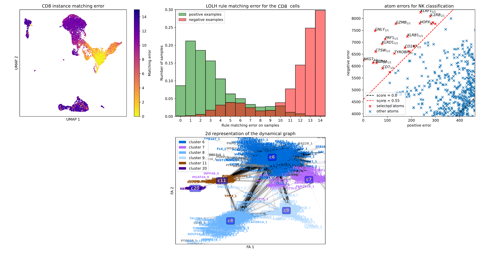

# LOLH: Learning Optimized Logical Hypothesis

## Background

LOLH is an Inductive Logic Programming framework based on the Learning From Interpretation Transition ([LFIT](https://github.com/Tony-sama/pylfit.git)) framework. Its goal is to learn logic rules from single-cell gene expression data, in order to infer logical/combinatorial relations between the genes. LOLH performs a selection of the genes based on a discrete optimization problem formulation (see references below). It is implemented in c++ and python 3.8.

## Dependencies

The following python packages are required to execute all the code from the examples: `scipy`, `numpy`, `pandas`, `scikit-learn`, `networkx`, `python-louvain`, `ForceAtlas2`, `umap-learn` and `matplotlib`. `pylfit` is also required to perform a comparison between the PRIDE and LOLH algorithms. The c++ code relies on openmp. The R script `DE_testing.R` for differential expression (DE) analysis relies on the R package [Seurat](https://satijalab.org/seurat/).

## Usage

The python source code is stored in the python folder and the c++ code is stored in the c++ folder. The c++ code needs to be compiled using the command `make`, from *LOLH* directory. The pre-processor definitions can be modified in `Constants.hpp` to activate parallel execution of the program (USE_OPENMP 1 and N_THREADS equal to the number of cores). These implementations provide functions to compute the most relevant variables (logical atoms) from a discrete dataset, in order to form logic rules. The rules can be created for a classical classification problem, or for the modeling of a dynamical system. Two examples are provided below: an example on an artifical dataset, and an example with a single-cell dataset.

## Examples

### Artificial dataset

In this example, an artificial dataset is randomly generated, by imitating the distribution of single-cell data. This dataset is used to compare several implementations for logical inference and classification. The complete example can be executed from the script `main.py`.

### Imagine dataset

In this example, several analysis are performed on a single-cell dataset. This dataset is a pbmc matrix obtained by [Imagine institute](https://www.institutimagine.org/fr). The dataset is available at http://doi.org/10.5281/zenodo.4730807. The script `init.sh` allows to automatically download the dataset and to perform its discretization.

* Coexpression analysis:

The analysis of coexpression consists in computing discrete correlations between the genes across the dataset. This analysis can be performed with the script `coexpression_main.py`. Differential expression can also be performed with Seurat, by using the command `Rscript DE_testing.R` to validate the identity of the gene clusters.

* Dynamical analysis:

Dynamical analysis of a singe-cell dataset intends to reveal regulatory interactions between the genes. To do so, transitions are computed from the dataset by using a neighborhood graph of the cells (computed from Seurat, with the `extract_transitions.R`). From this graph, dynamical correlations across the transitions are inferred with LOLH. This modeling approach can be performed with the script `dynamics_main.py`.

Alternative methods are considered for the inference of logical relations from dynamical data, including using RNA velocity methods for single-cell.

## Acknowledgment

Special thanks to Tony Ribeiro for his help with the LFIT framework and for suggesting the name LOLH, and to the Imagine Institute, and especially to Francesco Carbone and Mickaël Ménager for providing the dataset and performing statistical analyses and biological comparisons.

## References

* Samuel Buchet, Francesco Carbone, Morgan Magnin, Mickaël Ménager, and Olivier Roux. 2021. Inference of Gene Networks from Single Cell Data through Quantified Inductive Logic Programming. In The 12th International Conference on Computational Systems-Biology and Bioinformatics (CSBio2021). Association for Computing Machinery, New York, NY, USA, 48–63. DOI:https://doi.org/10.1145/3486713.3486746

* Ribeiro T., Folschette M., Magnin M., Roux O., Inoue K. (2018) Learning Dynamics with Synchronous, Asynchronous and General Semantics. In: Riguzzi F., Bellodi E., Zese R. (eds) Inductive Logic Programming. ILP 2018. Lecture Notes in Computer Science, vol 11105. Springer, Cham. https://doi.org/10.1007/978-3-319-99960-9_8

* Tony Ribeiro, Maxime Folschette, Morgan Magnin, Katsumi Inoue. Polynomial Algorithm For Learning From Interpretation Transition. 1st International Joint Conference on Learning & Reasoning, Oct 2021, (virtual), Greece. ⟨hal-03347026⟩
